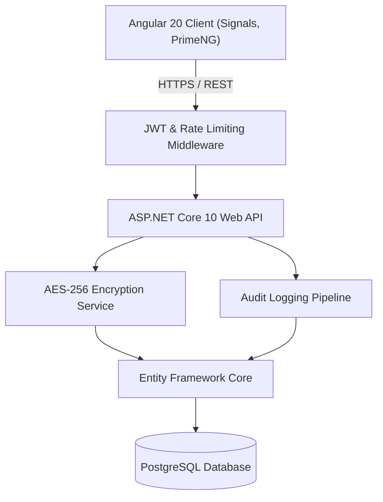

<div align="center">

# 📇 ContactDirectory App

**An enterprise-grade, secure, and modern Contact & Directory Management System.**

[](https://dotnet.microsoft.com/)
[](https://angular.dev/)
[](https://www.typescriptlang.org/)
[](https://www.postgresql.org/)
[](https://primeng.org/)
[](LICENSE)

---

### 🌐 Language / Dil
[🇹🇷 **Türkçe Dokümantasyon için buraya tıklayın (README.tr.md)**](README.tr.md)

</div>

---

## 📌 Overview

**ContactDirectory** is a full-stack enterprise web application engineered to manage corporate contacts, customer requests, and user directories with security, auditability, and speed. Built with **.NET 10 Web API** on the backend and **Angular 20 (Standalone & Signals)** on the frontend, it provides enterprise features like column-level AES-256 encryption, granular Role-Based Access Control (RBAC), audit logging, and bulk Excel/CSV operations.

---

## ✨ Key Features

### 🔐 Security & Compliance
- **AES-256 Column Encryption:** Sensitive PII (Personally Identifiable Information) fields are encrypted at rest using industry-standard AES-256.
- **JWT Authentication & Sliding Expiration:** Access tokens with refresh token rotation and automatic sliding session extension.
- **Inactivity Session Timeout:** Auto-logout functionality safeguarding unattended sessions.
- **Rate Limiting & Brute-Force Protection:** ASP.NET Core IP-based rate limiting on authentication and contact submission endpoints.
- **Server-Side Validation & Mass Assignment Guard:** Robust DTO validation rules rejecting invalid data and overposting attacks.
- **KVKK / GDPR Compliance:** Integrated data protection consents, agreement dialogs, and auditable user confirmation records.

### 👥 Directory & Contact Management
- **Advanced Data Table:** Instant search, multi-column sorting, and server-side pagination powered by PrimeNG.
- **Bulk Import & Export:** High-performance Excel (`.xlsx`) and CSV import with automated duplicate resolution strategies (*Skip*, *Overwrite*, or *Create New*).
- **Custom Avatar System:** User initials and dynamic SVG avatars with real-time profile synchronization.
- **Customer Contact Requests:** Public-facing contact submission with input validation (regex digit/letter constraints) and administrative ticket tracking.

### 🛡️ Administrative Dashboard
- **Role-Based Access Control (RBAC):** Distinct permissions and UI views for `Admin` and `User` roles.
- **Audit Logs System:** Deep activity logging capturing Entity, Action (`Create`, `Update`, `Delete`, `Login`, `Export`), User ID, Client IP, and UTC timestamps with filterable timeline view.
- **User Account Management:** Reset passwords, assign or revoke roles, manage account lifecycles, and view user analytics.
- **Contact Request Inquiries:** Dedicated admin inbox for reviewing customer submissions with status tracking and Excel export.

### 🎨 User Experience
- **Dark & Light Mode:** Full theme switching powered by PrimeNG design tokens with persistent local storage.
- **Reactive State Management:** Modern Angular Signals architecture ensuring fluid UI updates with zero unnecessary re-renders.
- **Fully Responsive:** Optimized layouts across desktop, tablet, and mobile devices.

---

## 🏗️ Architecture & Tech Stack



| Layer | Technology |
|---|---|
| **Frontend** | Angular 20, TypeScript, PrimeNG, RxJS, Angular Signals |
| **Backend** | .NET 10 (C#), ASP.NET Core Web API |
| **Database & ORM** | PostgreSQL, Entity Framework Core 10, Npgsql |
| **Security** | AES-256-CBC/GCM, JWT Bearer, BCrypt Password Hashing, AspNetCoreRateLimit |
| **Data Processing** | ClosedXML / XLSX / CsvHelper |

---

## 📁 Project Structure

```
ContactDirectory/
├── ContactDirectory.Api/          # ASP.NET Core Web API controllers, middleware, configurations
│   ├── Controllers/               # REST Endpoints (Contacts, Admin, Auth, ContactRequests, Audit)
│   ├── Services/                  # Business logic (Audit, Token, Encryption, Background tasks)
│   └── Program.cs                 # API host, dependency injection, and security pipeline
├── ContactDirectory.Core/         # Domain entities, DTOs, Enums, and interfaces
│   ├── Contact.cs                 # Contact entity model
│   ├── User.cs                    # Application user & roles
│   ├── AuditLog.cs                # System audit logging model
│   └── ContactRequest.cs          # Customer contact request model
├── ContactDirectory.DataAccess/   # EF Core DbContext, migrations, and database seeders
│   ├── AppDbContext.cs            # PostgreSQL database context & encryption value converters
│   └── Migrations/                # EF Core schema migration history
└── ContactDirectory.UI/           # Angular 20 Standalone client application
    └── src/app/
        ├── components/            # Shared UI components (Contact directory, Navbar, Profile)
        ├── features/              # Feature modules (Auth, Admin Dashboard, Audit Logs)
        └── services/              # Client services (API, Auth, Theme, Excel, Export)
```

---

## 🚀 Getting Started

### Prerequisites
- [.NET 10 SDK](https://dotnet.microsoft.com/download)
- [Node.js (v20+ or v22 LTS)](https://nodejs.org/)
- [PostgreSQL (v15+)](https://www.postgresql.org/)

---

### 1. Database Setup
Create a PostgreSQL database (e.g. `ContactDirectoryDb`):
```sql
CREATE DATABASE "ContactDirectoryDb";
```

### 2. Backend Configuration & Run
1. Navigate to `ContactDirectory.Api`:
   ```bash
   cd ContactDirectory.Api
   ```
2. Update database connection string in `appsettings.json` (or `appsettings.Development.json`):
   ```json
   {
     "ConnectionStrings": {
       "DefaultConnection": "Host=localhost;Port=5432;Database=ContactDirectoryDb;Username=postgres;Password=your_password"
     },
     "JwtSettings": {
       "Secret": "YourSuperSecretKeyMustBeAtLeast32CharactersLong!",
       "Issuer": "ContactDirectoryApi",
       "Audience": "ContactDirectoryApp",
       "AccessTokenExpirationMinutes": 60,
       "RefreshTokenExpirationDays": 7
     }
   }
   ```
3. Apply database migrations:
   ```bash
   dotnet ef database update --project ../ContactDirectory.DataAccess
   ```
4. Run the API:
   ```bash
   dotnet run
   ```
   *The Web API will be running on `http://localhost:5099` (or `https://localhost:7099`).*

---

### 3. Frontend Setup & Run
1. Navigate to `ContactDirectory.UI`:
   ```bash
   cd ../ContactDirectory.UI
   ```
2. Install npm packages:
   ```bash
   npm install
   ```
3. Run the development server:
   ```bash
   npm start
   ```
4. Open your browser and navigate to `http://localhost:4200`.

---

## 🧪 Testing & Verification

- **Backend compilation:**
  ```bash
  dotnet build
  ```
- **Frontend type-check & build:**
  ```bash
  npm run build
  ```

---

## 📄 License

This project is licensed under the [MIT License](LICENSE).
