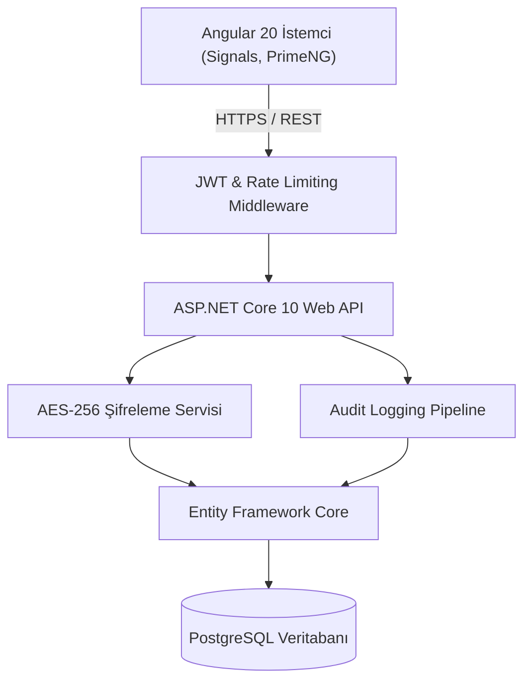

<div align="center">

# 📇 ContactDirectory Uygulaması

**Kurumsal Seviyede, Güvenli ve Modern Kişi & Rehber Yönetim Sistemi**

[](https://dotnet.microsoft.com/)
[](https://angular.dev/)
[](https://www.typescriptlang.org/)
[](https://www.postgresql.org/)
[](https://primeng.org/)
[](LICENSE)

---

### 🌐 Dil / Language
[🇬🇧 **Click here for English Documentation (README.md)**](README.md)

</div>

---

## 📌 Genel Bakış

**ContactDirectory**, kurumsal kişi ve rehber yönetimini, müşteri iletişim taleplerini ve kullanıcı rollerini en üst düzey güvenlik ve denetlenebilirlikle sağlamak için geliştirilmiş tam kapsamlı bir kurumsal web uygulamasıdır. 

Arka yüzde **.NET 10 Web API**, ön yüzde ise **Angular 20 (Standalone Bileşenler & Signals Mimarisi)** kullanılarak geliştirilmiştir. Veri tabanı seviyesinde kolon bazlı AES-256 şifreleme, rol tabanlı yetkilendirme (RBAC), uçtan uca denetim loglaması (Audit Logs) ve Excel/CSV toplu veri yönetimi sunar.

---

## ✨ Öne Çıkan Özellikler

### 🔐 Güvenlik ve Uyumluluk
- **AES-256 Kolon Bazlı Şifreleme:** T.C. Kimlik No gibi hassas kişisel veriler (PII), veri tabanında bekleyen veri (data-at-rest) olarak endüstri standardı AES-256 ile şifrelenir.
- **JWT Kimlik Doğrulama & Kayan Süre (Sliding Expiration):** Refresh token rotasyonu ve kullanıcının aktifliğine göre oturum süresini otomatik uzatan yapı.
- **Hareketsizlik Oturum Zaman Aşımı (Inactivity Timeout):** Açık kalan oturumları korumak adına belirli bir süre işlem yapılmadığında güvenli otomatik çıkış mekanizması.
- **Hız Sınırlama (Rate Limiting):** Kaba kuvvet (brute-force) ve DDoS girişimlerine karşı IP ve istemci bazlı hız limitleme altyapısı.
- **KVKK / GDPR Uyumluluğu:** Entegre aydınlatma metinleri, onay pencereleri ve denetlenebilir kullanıcı onay kayıtları.

### 👥 Rehber ve Kişi Yönetimi
- **Gelişmiş Veri Tablosu:** PrimeNG destekli anlık arama, çoklu kolon sıralama ve sunucu taraflı sayfalama (pagination).
- **Toplu İçe / Dışa Aktarma:** Çift kayıt çakışma stratejileri (*Atla*, *Üzerine Yaz*, *Yeni Kayıt Oluştur*) ile yüksek performanslı Excel (`.xlsx`) ve CSV aktarımı.
- **Özel Avatar Sistemi:** Baş harflerden oluşan veya dinamik SVG avatarlar, anlık profil senkronizasyonu.
- **Müşteri İletişim Talepleri:** Rehber ekranından güvenli form girişi (harf/rakam kısıtlamalı girdi validasyonu) ve talep takip akışı.

### 🛡️ Yönetici (Admin) Paneli
- **Rol Tabanlı Erişim Kontrolü (RBAC):** `Admin` ve `User` rolleri için ayrıştırılmış API yetkilendirmesi ve arayüzler.
- **Denetim Logları (Audit Logs):** Varlık, işlem türü (`Create`, `Update`, `Delete`, `Login`, `Export`), kullanıcı, istemci IP'si ve zaman damgası kaydeden, filtreli log izleme ekranı.
- **Kullanıcı Hesap Yönetimi:** Şifre sıfırlama, rol atama/kaldırma, hesap silme ve kullanıcı istatistikleri.
- **İletişim Talepleri Yönetimi:** Gelen müşteri taleplerini inceleme, onaylı silme ve talepleri Excel dosyası olarak dışa aktarma.

### 🎨 Kullanıcı Deneyimi
- **Karanlık / Aydınlık Mod:** Yerel depolamada saklanan PrimeNG Aura tema desteği.
- **Reaktif Durum Yönetimi:** Angular Signals mimarisi ile gereksiz yeniden renderları engelleyen, yüksek performanslı arayüz.
- **Tam Duyarlı (Responsive):** Masaüstü, tablet ve mobil cihazlara tam uyumlu arayüz düzeni.

---

## 🏗️ Mimari ve Teknoloji Yığını



| Katman | Teknoloji |
|---|---|
| **Ön Yüz (Frontend)** | Angular 20, TypeScript, PrimeNG, RxJS, Angular Signals |
| **Arka Yüz (Backend)** | .NET 10 (C#), ASP.NET Core Web API |
| **Veri Tabanı & ORM** | PostgreSQL, Entity Framework Core 10, Npgsql |
| **Güvenlik** | AES-256-CBC/GCM, JWT Bearer, BCrypt Parola Hashleme, AspNetCoreRateLimit |
| **Veri İşleme** | ClosedXML / XLSX / CsvHelper |

---

## 📁 Proje Dizin Yapısı

```
ContactDirectory/
├── ContactDirectory.Api/          # ASP.NET Core Web API denetleyicileri, ara katmanlar ve ayarlar
│   ├── Controllers/               # REST Uç Noktaları (Contacts, Admin, Auth, ContactRequests, Audit)
│   ├── Services/                  # İş mantığı (Audit, Token, Şifreleme, Arka plan servisleri)
│   └── Program.cs                 # API ana yapılandırması ve DI servisleri
├── ContactDirectory.Core/         # Domain varlıkları (Entity), DTO'lar, Enum'lar ve arayüzler
│   ├── Contact.cs                 # Kişi varlık modeli
│   ├── User.cs                    # Kullanıcı ve rol modeli
│   ├── AuditLog.cs                # Sistem denetim günlüğü modeli
│   └── ContactRequest.cs          # Müşteri iletişim talebi modeli
├── ContactDirectory.DataAccess/   # EF Core DbContext, migration geçmişi ve seed sınıfları
│   ├── AppDbContext.cs            # PostgreSQL DbContext & kolon şifreleme dönüştürücüleri
│   └── Migrations/                # EF Core veritabanı geçiş dosyaları
└── ContactDirectory.UI/           # Angular 20 Standalone istemci uygulaması
    └── src/app/
        ├── components/            # Paylaşılan UI bileşenleri (Rehber, Navbar, Profil vb.)
        ├── features/              # Özellik modülleri (Auth, Admin Dashboard, Audit Logs)
        └── services/              # İstemci servisleri (API, Auth, Tema, Excel aktarımı)
```

---

## 🚀 Kurulum ve Çalıştırma

### Gereksinimler
- [.NET 10 SDK](https://dotnet.microsoft.com/download)
- [Node.js (v20+ veya v22 LTS)](https://nodejs.org/)
- [PostgreSQL (v15+)](https://www.postgresql.org/)

---

### 1. Veritabanı Hazırlığı
PostgreSQL üzerinde veritabanınızı oluşturun:
```sql
CREATE DATABASE "ContactDirectoryDb";
```

### 2. Backend Yapılandırması ve Başlatma
1. `ContactDirectory.Api` dizinine geçin:
   ```bash
   cd ContactDirectory.Api
   ```
2. `appsettings.json` (veya `appsettings.Development.json`) dosyasındaki bağlantı dizesini düzenleyin:
   ```json
   {
     "ConnectionStrings": {
       "DefaultConnection": "Host=localhost;Port=5432;Database=ContactDirectoryDb;Username=postgres;Password=veritabani_sifreniz"
     },
     "JwtSettings": {
       "Secret": "EnAz32KarakterdenOlusanCokGizliBirGuvenlikAnahtari!",
       "Issuer": "ContactDirectoryApi",
       "Audience": "ContactDirectoryApp",
       "AccessTokenExpirationMinutes": 60,
       "RefreshTokenExpirationDays": 7
     }
   }
   ```
3. Veritabanı tablolarını oluşturmak için migration'ları uygulayın:
   ```bash
   dotnet ef database update --project ../ContactDirectory.DataAccess
   ```
4. API'yi çalıştırın:
   ```bash
   dotnet run
   ```
   *Web API varsayılan olarak `http://localhost:5099` (veya `https://localhost:7099`) adresinde yayına başlayacaktır.*

---

### 3. Frontend Yapılandırması ve Başlatma
1. `ContactDirectory.UI` dizinine geçin:
   ```bash
   cd ../ContactDirectory.UI
   ```
2. Bağımlılıkları yükleyin:
   ```bash
   npm install
   ```
3. Geliştirme sunucusunu başlatın:
   ```bash
   npm start
   ```
4. Tarayıcınızda `http://localhost:4200` adresini açın.

---

## 🧪 Derleme ve Doğrulama

- **Backend derleme doğrulaması:**
  ```bash
  dotnet build
  ```
- **Frontend tip kontrolü ve derleme:**
  ```bash
  npm run build
  ```

---

## 📄 Lisans

Bu proje [MIT Lisansı](LICENSE) kapsamında lisanslanmıştır.
